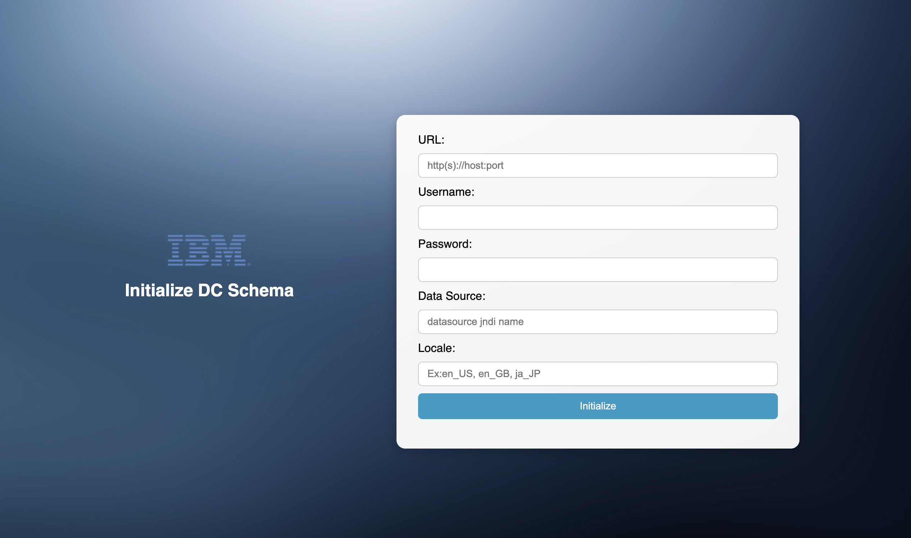
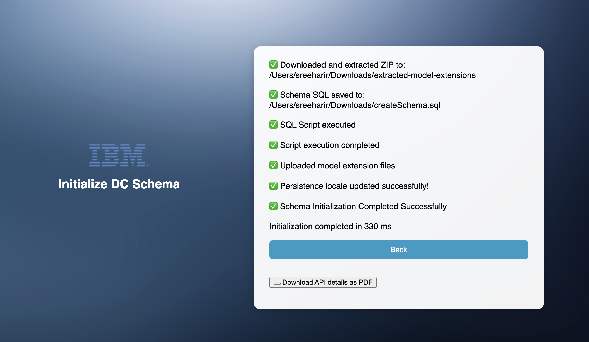

# ODM-Schema Initializer

## Features
This is a source code with runnable jar to initialize an ODM Decision center database using the Decision center REST APIs.

## Requirements
 1. Decision center application should be up and running in new schema.
 1. JDK version 17 or up

## Deployment and Run
 1. Import the project source code
 1. Build the war file with maven or Directly Download the war file DC-Schema-Initializer-UI.war from repository and use it.
 1. Deploy or Run the war file: java -jar DC-Schema-Initializer-UI.war
 1. Application will run in the port 8080

# Issues and contributions
For issues relating specifically to this repository, please use the [GitHub issue tracker](../../issues).
We welcome contributions following [our guidelines](CONTRIBUTING.md).

# License
The code found in this project are licensed under the [Apache License 2.0](LICENSE).

# Notice
© Copyright IBM Corporation 2025.
